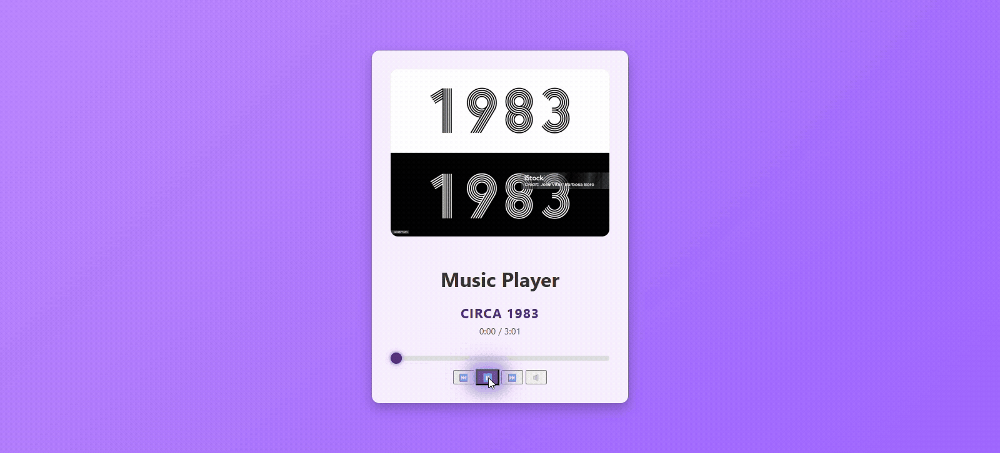

# 🎵 Music Player

This is a simple, modern music player. 
It includes basic audio functionality and allows you to play multiple tracks, view progress, switch songs, and display album artwork dynamically.

## ✨ Features

- 🎶 Play / Pause songs
- ⏮️ Previous / Next track
- 📉 Progress bar with seek functionality
- 🔇 Mute / Unmute option
- 🖼️ Album cover displayed dynamically
- 📱 Responsive and clean UI
- ⚡ Smooth transitions and animations

🌐 Link to Website

https://mariaromerof.github.io/Music-Player/

📸 Live Demo  

💻 Built With

  
  
  

---

Feel free to explore, use, or improve this project. 😊